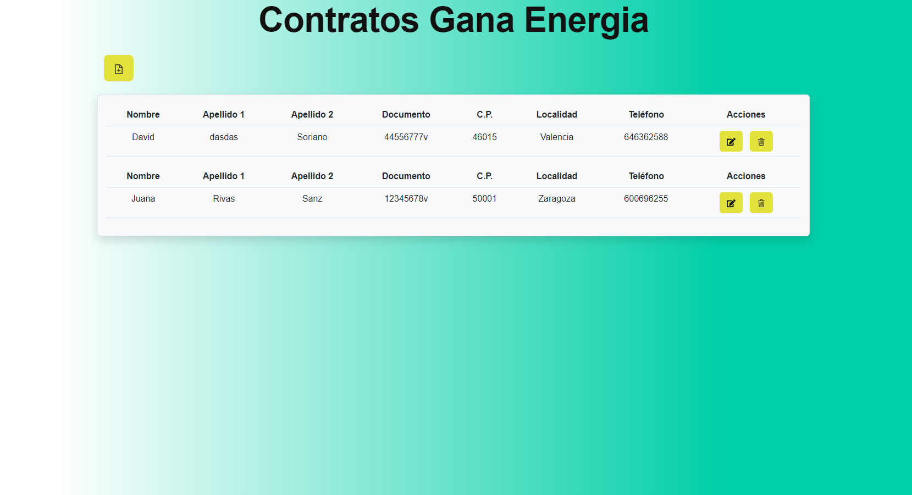
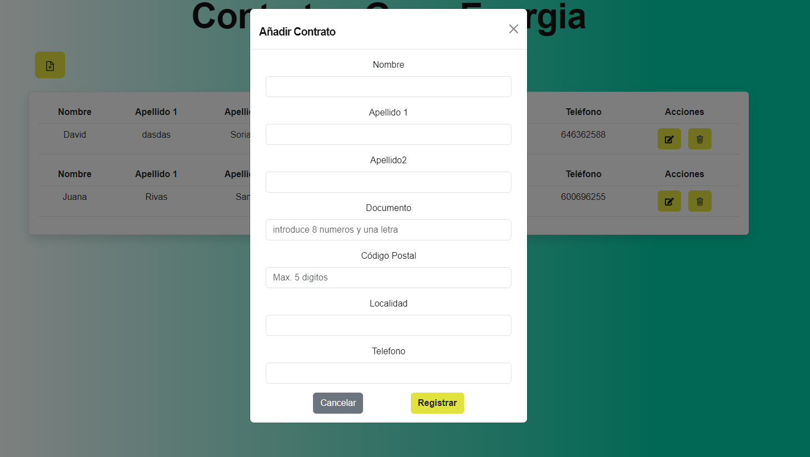
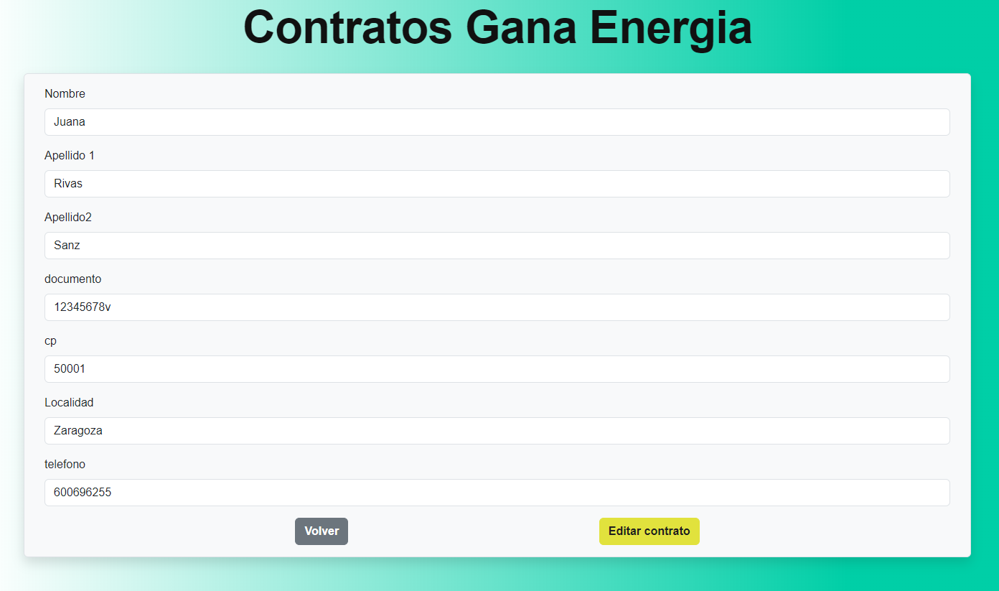

# <center>:deciduous_tree: Prueba técnica Gana Energía, Full Stack MERN :deciduous_tree:</center>

## :clipboard: Índice :clipboard:

- [Sobre el proyecto](#bookmarktabs-sobre-el-proyecto-bookmarktabs)

  - [Instalación y despliegue](#nutandbolt-instalación-y-despliegue)

  - [Tecnologías utilizadas](#wrench-tecnologiaspackages-utilizados)

  - [Motivación del mismo](#dart-origen)

  - [Objetivos](#pushpin-objetivos)

- [Descripción del proyecto](#greenbook-descripción-del-proyecto-greenbook)

  - [API](#1-api)

- [Agradecimientos](#agradecimientos)

- [Autores](#raisedhands-autor-raisedhands)

---

# :bookmark_tabs: Sobre el proyecto :bookmark_tabs:

Vistas previas:







---

## :nut_and_bolt: Instalación y despliegue

El proyecto se subirá a un repositorio público de GitHub.
Además, el backend procede de la API que he creado en MongoDB: [API](https://github.com/Dubesor22/backend-gana).

Para instalar este proyecto debes hacer lo siguiente: primero acceder desde github a los dos repositorios y proceder a clonártelos con el siguiente comando:

```
git clone https://github.com/Dubesor22/frontend-gana
git clone https://github.com/Dubesor22/backend-gana
```

Una vez clonado el repositorio es muy importante que en tu consola instales todos los npm que necesita cada proyecto con el siguiente comando:

```
npm i
```

Por último, en caso de querer correr en local, procede a levantar el servidor primero en el proyecto de backend con este comando:

```
npm run dev
```

Y después en el proyecto de frontend, entras con cd frontend-gana y una vez dentro de la carpeta, levantas el servidor:

```
npm start
```

Automáticamente se te abrirá una nueva ventana del navegador con la página web.

Los repositorios estan actualmente programados para funcionar en local.

---

## :wrench: Tecnologías/packages utilizados

- Javascript
- React
- Bootstrap
- Context
- React Router
- Axios
- NodeJS
- MongoDB
- Mongoose
- Font awesome
- Dotenv
- Postman

---

## :dart: Motivación

El origen del proyecto es la creación de un MVP para una Prueba técnica, que consta de registrar contratos en una tabla con datos de usuarios y estos mismos poder editarlos o borrarlos (CRUD)

Para ello he procedido a la creación tanto de Frontend como de Backend para poder guardar los datos en un BDD en mongo atlas. Y un front para poder hacer acopio de ellos mismos.

Esta app tiene una vista general de página, en la que estará la tabla con los contratos y luego un modal para introducir nuevos usuarios y una vista en otra página para el edit.

## :pushpin: Objetivos

Objetivos de la prueba para el Frontend:

- Crear una aplicación en React que permita visualizar, crear, editar y borrar contratos.

- Formulario para dar de alta y modificar los datos de los contratos

- Validación de los datos del formulario con campos requeridos.

## 1. API

Documentación en adicional de enpoints en Postman:

```
https://documenter.getpostman.com/view/21013501/2s8ZDVZNoK
```

---

# :purple_heart: Agradecimientos :purple_heart:

Agradecimientos a Gana Energía por dejarme participar en su proceso de selección.

---

# :raised_hands: Autor :raised_hands:

- [David Úbeda Soriano](https://github.com/Dubesor22)
